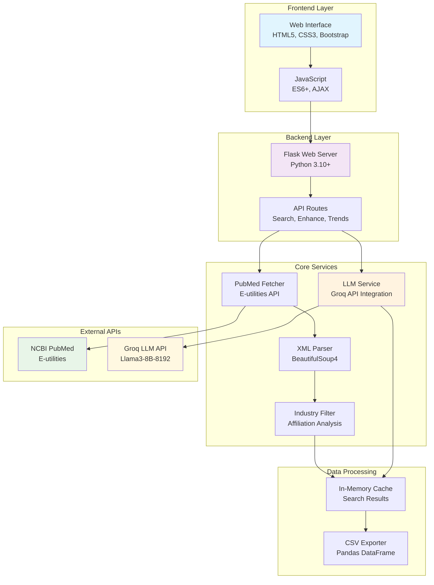
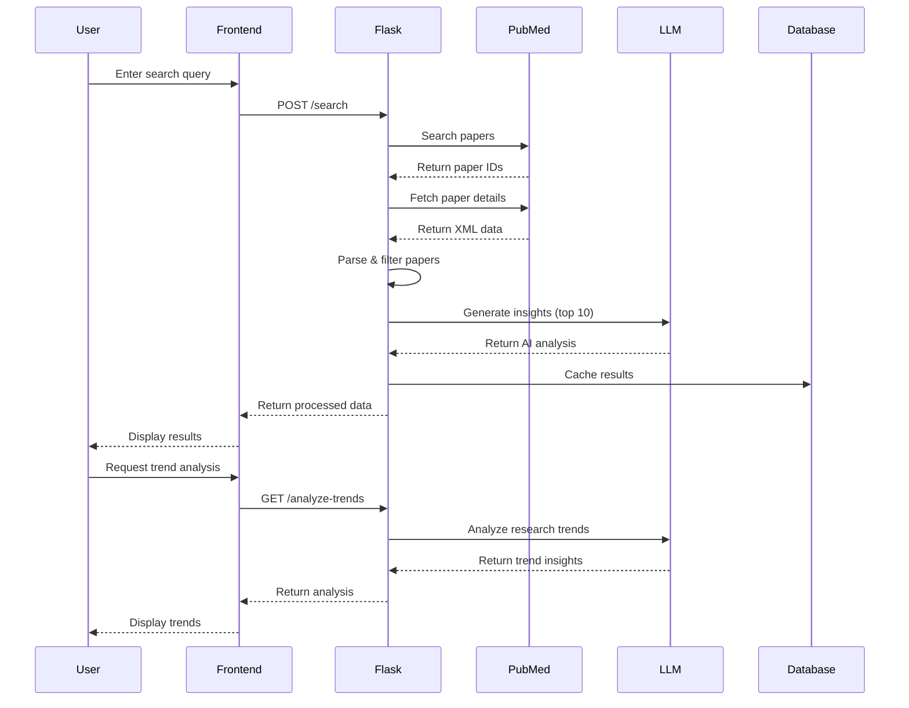
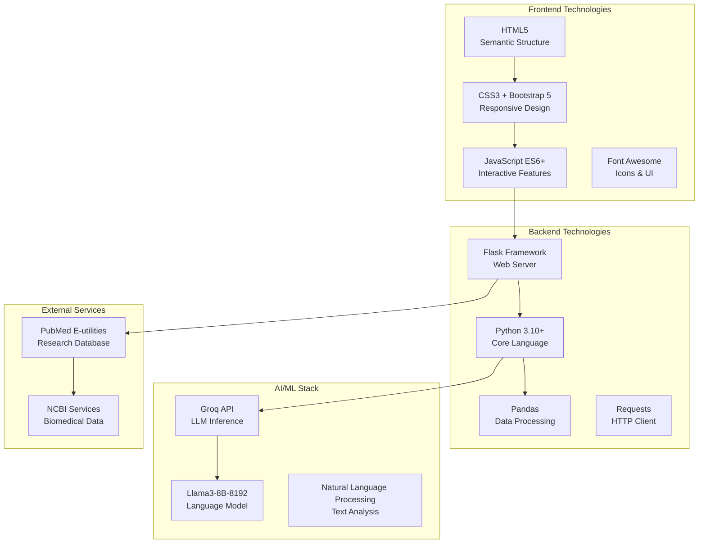
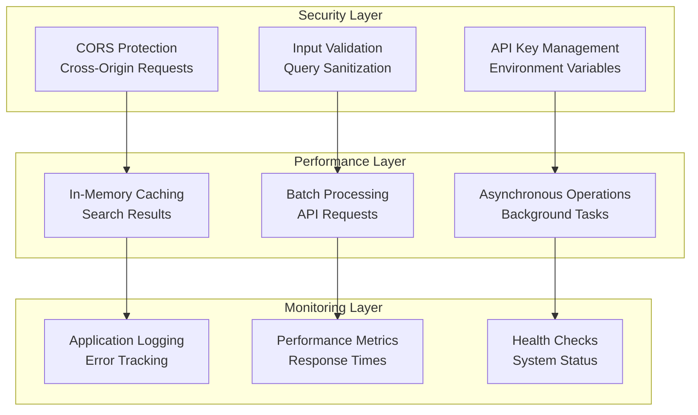
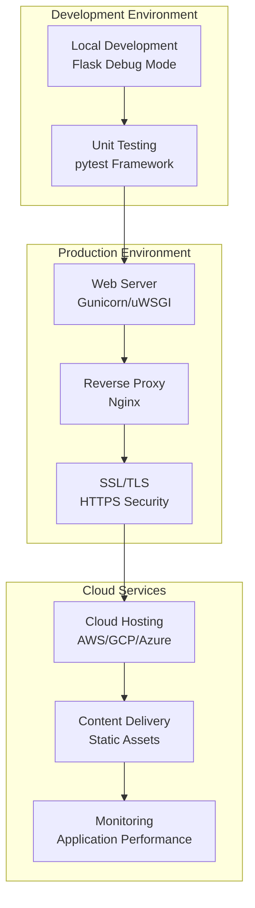
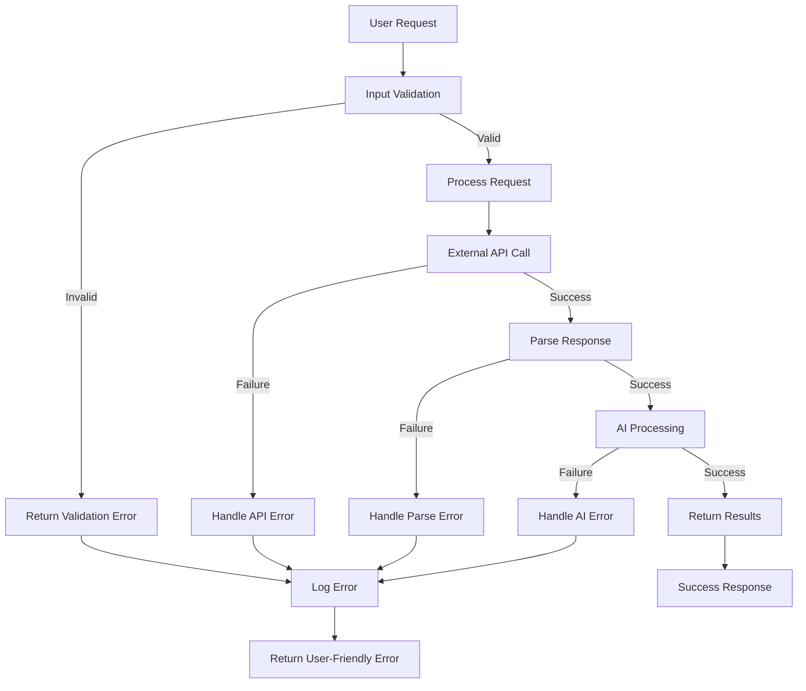

# System Architecture Diagrams

## High-Level System Architecture

## Data Flow Architecture

## Component Interaction Model

```mermaid
graph LR
    subgraph "Input Processing"
        Query[User Query]
        Enhance[AI Enhancement]
        Search[PubMed Search]
    end
    
    subgraph "Data Retrieval"
        Fetch[Fetch Papers]
        Parse[Parse XML]
        Extract[Extract Metadata]
    end
    
    subgraph "Analysis Engine"
        Industry[Industry Detection]
        AI[AI Insights]
        Trends[Trend Analysis]
    end
    
    subgraph "Output Generation"
        Format[Format Results]
        Paginate[Pagination]
        Export[CSV Export]
    end
    
    Query --> Enhance
    Enhance --> Search
    Search --> Fetch
    Fetch --> Parse
    Parse --> Extract
    Extract --> Industry
    Industry --> AI
    AI --> Trends
    Trends --> Format
    Format --> Paginate
    Paginate --> Export
```

## Technology Stack Overview

## Security and Performance Architecture

## Deployment Architecture

## Error Handling Flow

This architecture ensures:
- **Scalability**: Modular design allows independent scaling
- **Reliability**: Comprehensive error handling and fallbacks
- **Performance**: Caching and batch processing optimization
- **Security**: Input validation and secure API management
- **Maintainability**: Clear separation of concerns and documentation
